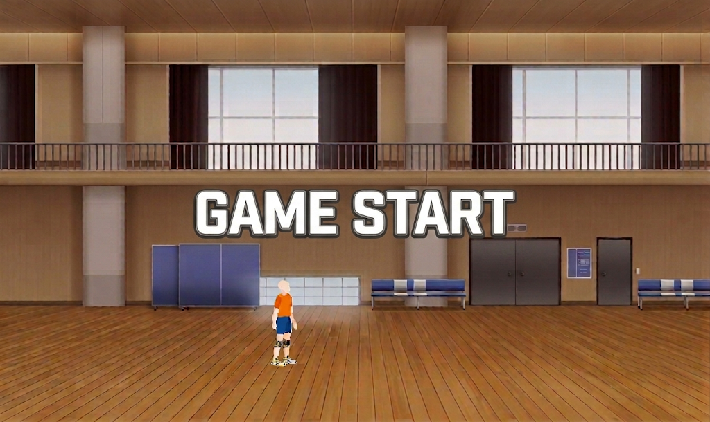
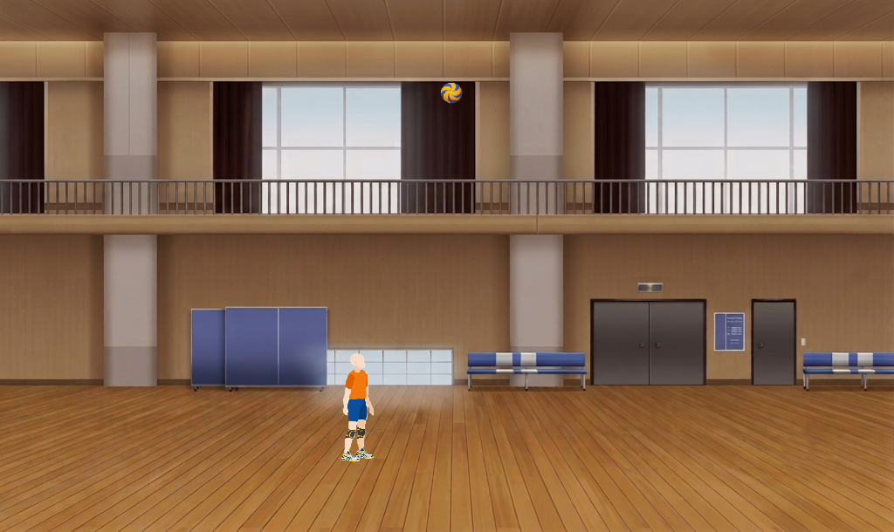
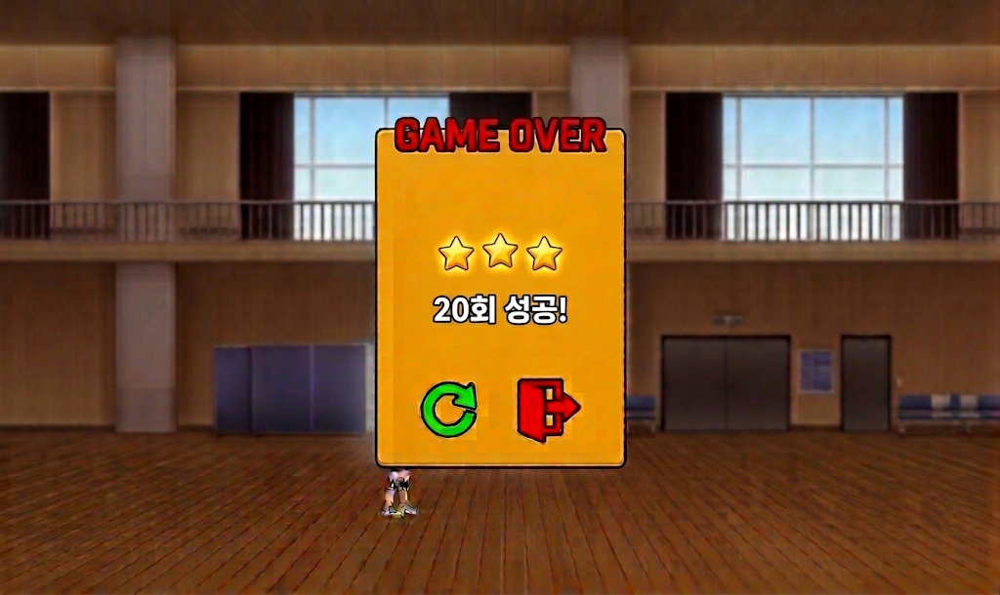

# 리프팅 챌린지
## 게임 소개
  - 날아오는 방해물을 피하고 타이밍에 맞게 키를 눌러 배구공 리프팅을 하는 사이드뷰 아케이드 게임
## 게임 목표
  - 게임 오버 전까지 최대한 많이 리프팅 성공하기
## 게임 규칙
  - 배구공이 3번 바닥에 닿으면 게임 오버
  - 리프팅을 성공한 고도가 낮을수록 고득점
  - 리프팅을 성공할수록 배구공을 높이 띄움
  - 방해물에 맞으면 일정 시간동안 이속 감소
  - 대쉬 후 일정 시간 동안 이속 감소, 달리기 불가
## 조작키
  - a : 왼쪽 이동
  - b : 오른쪽 이동
  - w : 점프
  - 쉬프트 : 달리기
  - 스페이스바 : 슬라이딩
  - 마우스 왼쪽 클릭 : 리프팅하기
## 인게임 양상
  - 1. 게임 시작 버튼 클릭
  - 2. 게임 시작 시 인게임 화면 상단 가운데에서 배구공 추락
  - 3. 배구공이 추락하는 타이밍에 맞춰 마우스 왼쪽 클릭
  - 4. 늘어나는 방해물을 피하며 배구공 리프틍
  - 5. 게임 오버 후 점수 확인
## 필요 이미지
  - 플레이어 이미지
  - 방해물 이미지
  - 체육관 이미지
  - 배구공 이미지
  - 다시시작 버튼
  - 나가기 버튼
  - 게임시작 버튼
## 필요 사운드
  - 배구공 튕기는 소리
  - 호루라기 소리
  - 발구르는 소리
  - 기합 소리

## 예시 장면

### 게임 시작 Scene

- 시작하기 버튼이 표시된다.
- 시작하기 버튼을 누르면 게임이 시작.

### 게임 플레이 Scene

- 게임 시작 시 상단 중앙에서 배구공이 떨어진다
- 플레이어블 캐릭터를 a와 d를 사용해 좌우로 이동하여 조작한다.
- 타이밍에 맞게 마우스 왼쪽 클릭을 해서 배구공을 리프팅한다.
- 리프팅을 성공할수록 배구공이 더 높이 뜨게된다.

### 게임 종료 Scene

- 배구공을 3번 바닥에 떨어뜨리면.
- 최종 점수를 표시한다.
- 다시하기 버튼을 누르면 게임을 처음부터 다시 시작한다.
- 나가기 버튼을 누르면 타이틀 화면으로 돌아간다
