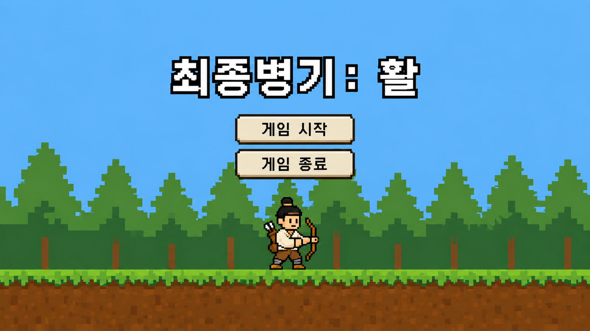
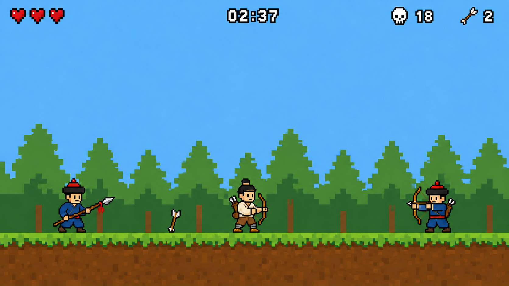
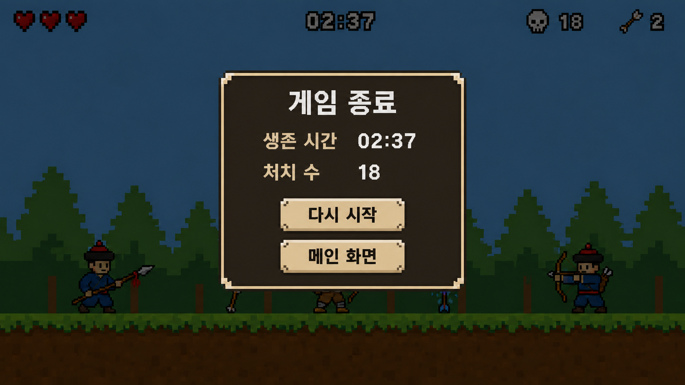

# 최종병기: 활

- 작성자: 26031023 이진호
- 장르: 2D 사이드뷰 아레나 무한 생존 액션
- 플랫폼: Windows PC
- 개발 환경: C#, glc2d

## 1. 게임 개요

청나라 병사들에게 포위된 조선인 사냥꾼이 한정된 화살을 회수하며 최대한 오래 살아남는 게임이다.

플레이어는 화살을 쏜 뒤 직접 회수해야 다시 공격할 수 있다. 공격을 위해 화살을 멀리 보낼수록 다음 공격을 위해 위험한 위치까지 이동해야 하며, 이 과정에서 공격과 회피의 판단이 반복된다.

### 핵심 경험

- 한정된 화살을 언제, 어느 방향으로 사용할지 판단한다.
- 적 사이로 이동해 사용한 화살을 회수한다.
- 처치 수에 따라 화살을 늘리고, 계속 증가하는 적의 수에 대응한다.

### 승리와 패배

- 별도의 승리 조건은 없다.
- 플레이어의 체력이 0이 되면 게임이 종료된다.
- 최종 기록은 생존 시간과 처치 수로 결정한다.

## 2. 실행 및 화면 사양

| 항목 | 사양 |
| --- | --- |
| 화면 크기 | 1280×720 |
| 화면 비율 | 16:9 |
| 화면 방식 | 창 모드, 크기 변경 불가 |
| 카메라 | 고정 카메라, 이동 및 확대 없음 |
| 목표 프레임 | 60 FPS |
| 좌표 원점 | 화면 좌측 상단 `(0, 0)` |
| 시간 계산 | 프레임 수가 아닌 `DeltaTime` 기준 |
| 거리 단위 | 픽셀 `(px)` |

## 3. 게임 진행 흐름

`시작 Scene → 플레이 Scene → 종료 Scene`

1. 게임을 실행하면 시작 Scene을 표시한다.
2. `게임 시작` 버튼을 누르면 플레이 Scene으로 이동한다.
3. 플레이어와 게임 데이터를 초기화하고 1초 뒤 첫 적을 생성한다.
4. 플레이어가 적을 처치하고 화살을 회수하며 생존한다.
5. 시간이 지날수록 동시에 존재할 수 있는 적의 수가 증가한다.
6. 플레이어의 체력이 0이 되면 조작과 시간 측정을 중지한다.
7. 0.5초 뒤 종료 Scene으로 이동해 최종 기록을 표시한다.
8. `다시 시작`은 모든 데이터를 초기화하고 플레이 Scene을 다시 시작한다.
9. `메인 화면`은 시작 Scene으로 이동한다.

## 4. Scene 구성

### 4.1 시작 Scene



#### 표시 요소

| 요소 | 위치 및 기능 |
| --- | --- |
| 게임 제목 | 화면 중앙 상단, `최종병기: 활` 표시 |
| 게임 시작 | 중앙 첫 번째 버튼, 클릭 시 플레이 Scene 이동 |
| 게임 종료 | 중앙 두 번째 버튼, 클릭 시 프로그램 종료 |
| 배경 | 밝은 낮의 숲 |
| 캐릭터 | 화면 하단 중앙에 조선인 사냥꾼 표시 |

#### 버튼 좌표

| 버튼 | X | Y | 너비 | 높이 |
| --- | ---: | ---: | ---: | ---: |
| 게임 시작 | 490 | 310 | 300 | 70 |
| 게임 종료 | 490 | 400 | 300 | 70 |

- 마우스가 버튼 위에 있으면 버튼 색상을 밝게 표시한다.
- 마우스 왼쪽 버튼을 눌렀을 때 해당 기능을 실행한다.
- 버튼 영역 밖을 클릭하면 아무 동작도 하지 않는다.

---

### 4.2 플레이 Scene



#### 표시 요소

| 요소 | 위치 |
| --- | --- |
| 체력 | 좌측 상단 |
| 생존 시간 | 상단 중앙 |
| 처치 수 | 우측 상단 |
| 사용 가능한 일반 화살 수 | 우측 상단, 처치 수의 우측 |
| 플레이어 | 게임 시작 시 바닥 중앙 |
| 적 | 화면 왼쪽 또는 오른쪽 끝 |
| 일반 화살 | 발사되거나 바닥에 떨어진 실제 위치 |

#### HUD 기준 좌표

| 요소 | 기준 좌표 | 표시 규칙 |
| --- | --- | --- |
| 체력 | `(32, 24)` | 현재 체력만큼 하트 표시, 간격 12px |
| 생존 시간 | `(640, 24)` | 중앙 정렬, `분:초` 형식 |
| 처치 수 | `(980, 24)` | 해골 아이콘과 숫자 표시 |
| 일반 화살 | `(1130, 24)` | 화살 아이콘과 현재 발사 가능 수 표시 |

- 생존 시간은 플레이 Scene이 시작된 시점부터 증가한다.
- 생존 시간이 10초 미만이어도 `00:09`처럼 두 자리로 표시한다.
- 처치 수는 적의 체력이 0이 되는 순간 1 증가한다.

---

### 4.3 종료 Scene



#### 표시 요소

| 요소 | 기능 |
| --- | --- |
| 어두운 배경 | 사망 순간의 플레이 화면 위에 반투명 검은색 표시 |
| 게임 종료 | 화면 중앙 결과창 제목 |
| 생존 시간 | 사망 순간에 저장된 최종 시간 |
| 처치 수 | 사망 순간에 저장된 최종 처치 수 |
| 다시 시작 | 플레이 데이터를 초기화하고 플레이 Scene 이동 |
| 메인 화면 | 시작 Scene 이동 |

#### 결과창 좌표

| 요소 | X | Y | 너비 | 높이 |
| --- | ---: | ---: | ---: | ---: |
| 결과창 | 380 | 130 | 520 | 460 |
| 다시 시작 | 490 | 440 | 300 | 70 |
| 메인 화면 | 490 | 530 | 300 | 70 |

## 5. 아레나 구성

| 항목 | 값 |
| --- | --- |
| 지면 높이 | `Y = 620` |
| 플레이어 이동 가능 범위 | `X = 32~1248` |
| 공중 발판 | 없음 |
| 화면 좌우 벽 | 플레이어만 통과 불가 |
| 적 등장 위치 | 왼쪽 `X = 48`, 오른쪽 `X = 1232` |

- 지면 하나로 구성하며 카메라는 이동하지 않는다.
- 플레이어는 화면 바깥으로 나갈 수 없다.
- 적은 화면 양쪽 끝의 등장 위치에서 생성된다.
- 배경과 지면은 충돌 판정에 사용하지 않고, 별도의 지면 충돌 영역을 사용한다.

## 6. 조작 방법

| 입력 | 동작 |
| --- | --- |
| `A` | 왼쪽 이동 |
| `D` | 오른쪽 이동 |
| `Space` | 점프 |
| `Left Shift` | 대시 |
| 마우스 이동 | 조준 방향 변경 |
| 마우스 왼쪽 버튼 | 일반 화살 발사 |

### 입력 처리 규칙

- `A`와 `D`를 동시에 누르면 좌우 이동을 정지한다.
- 점프는 지면에 닿아 있을 때만 시작할 수 있다.
- 발사 버튼은 누른 순간 한 번만 처리하며, 누르고 있는 동안 자동 연사하지 않는다.
- 플레이어는 이동하거나 점프하는 중에도 조준하고 발사할 수 있다.
- 대시 중, 피격 경직 중, 사망 상태에서는 화살을 발사할 수 없다.

## 7. 플레이어 사양

### 기본 능력치

| 항목 | 값 |
| --- | ---: |
| 최대 체력 | 3 |
| 시작 체력 | 3 |
| 충돌 영역 | 40×64px |
| 시작 위치 | 충돌 영역의 바닥 중앙이 `(640, 620)` |
| 좌우 이동속도 | 300px/초 |
| 중력 | 1,800px/초² |
| 최대 낙하속도 | 900px/초 |
| 점프 초기속도 | -700px/초 |

### 이동 규칙

- 좌우 이동은 가속 없이 즉시 목표 속도를 적용한다.
- 키를 놓으면 좌우 속도를 즉시 0으로 만든다.
- 점프 후 지면에 닿으면 수직속도를 0으로 만들고 점프 가능 상태로 전환한다.
- 캐릭터가 바라보는 방향은 마지막 이동 방향이 아니라 마우스 커서의 X좌표를 기준으로 한다.
- 마우스가 플레이어보다 왼쪽에 있으면 왼쪽, 오른쪽에 있으면 오른쪽을 바라본다.

### 대시

| 항목 | 값 |
| --- | ---: |
| 대시 속도 | 650px/초 |
| 지속시간 | 0.18초 |
| 재사용 대기시간 | 0.6초 |
| 무적시간 | 대시가 유지되는 0.18초 전체 |
| 공중 사용 횟수 | 착지 전 1회 |

- 방향키를 누른 상태에서 대시하면 해당 방향으로 이동한다.
- 방향키를 누르지 않았다면 현재 바라보는 방향으로 이동한다.
- 대시 중에는 수직 위치를 유지하고 중력을 적용하지 않는다.
- 대시가 끝나면 기존의 수직속도를 다시 적용한다.
- 지면에 닿으면 공중 대시 사용 횟수를 초기화한다.
- 대시 중 적이나 적의 화살과 접촉해도 피해를 받지 않는다.

## 8. 피격 및 사망

| 항목 | 값 |
| --- | ---: |
| 1회 피해량 | 체력 1 |
| 피격 후 무적시간 | 1.0초 |
| 피격 경직 | 0.15초 |
| 수평 넉백 속도 | 220px/초 |
| 수직 넉백 속도 | -250px/초 |

- 적의 몸, 창 공격, 적 화살 중 하나와 충돌하면 피해를 받는다.
- 같은 프레임에 여러 공격이 겹쳐도 체력은 1만 감소한다.
- 넉백 방향은 피해를 준 대상의 반대 방향이다.
- 피격 경직 중에는 이동, 점프, 대시, 발사를 할 수 없다.
- 무적시간에는 캐릭터를 0.1초 간격으로 깜빡이게 표시한다.
- 무적시간 중 추가 충돌은 무시하고 적의 공격 상태는 유지한다.
- 체력이 0 이하가 되면 사망 상태로 전환하고 모든 플레이 입력을 막는다.
- 사망 순간 생존 시간과 처치 수를 저장하고 게임 내 시간 갱신을 멈춘다.

## 9. 조준 및 일반 화살

### 조준

- 조준 방향은 `플레이어 활 중심 → 마우스 커서` 방향 벡터로 계산한다.
- 마우스 커서가 활 중심과 같은 위치에 있으면 발사하지 않는다.
- 별도의 조준선은 표시하지 않고 마우스 커서를 조준점으로 사용한다.

### 일반 화살 능력치

| 항목 | 값 |
| --- | ---: |
| 시작 총보유량 | 1개 |
| 초기속도 | 900px/초 |
| 화살 중력 | 450px/초² |
| 공격력 | 1 |
| 발사 간격 | 0.35초 |
| 비행 충돌 영역 | 28×8px |
| 바닥 회수 영역 | 32×28px |

### 일반 화살 상태

`보유 → 비행 → 낙하 또는 바닥 고정 → 회수 → 보유`

1. 발사 시 사용 가능한 일반 화살 수를 1 감소시킨다.
2. 화살은 조준 방향으로 900px/초의 초기속도를 얻는다.
3. 비행 중 매초 수직속도에 450px/초²의 중력을 더한다.
4. 화살 이미지는 현재 이동 방향에 맞춰 회전한다.
5. 적에게 명중하면 공격력을 한 번 적용하고 관통하지 않는다.
6. 명중 후 공격 판정을 제거하고 해당 X좌표의 바닥으로 떨어진다.
7. 지면에 닿으면 이동을 멈추고 회수 가능한 상태가 된다.
8. 화면 좌우 또는 위쪽 경계에 닿으면 해당 X좌표에서 수직으로 떨어진다.
9. 회수 상태의 화살과 플레이어가 닿으면 화살을 제거하고 사용 가능 수를 1 증가시킨다.

### 예외 처리

- 일반 화살 총보유량은 `사용 가능 화살 + 비행 중 화살 + 바닥 화살`의 합과 항상 같아야 한다.
- 사용 가능한 화살이 0개이면 마우스 왼쪽 버튼 입력을 무시한다.
- 한 화살이 같은 적에게 두 번 피해를 줄 수 없다.
- 한 프레임에 여러 적과 겹치면 화살 진행 방향에서 가장 가까운 적 한 명만 맞는다.
- 일반 화살은 시간이 지나도 사라지지 않는다.

## 10. 일반 화살 추가 획득

- 누적 처치 수가 기준값에 도달하면 영구적으로 사용할 수 있는 일반 화살 아이템을 생성한다.
- 추가 화살 아이템은 플레이어에게서 더 먼 쪽 바닥에 생성한다.
- 왼쪽 후보 위치는 `(160, 592)`, 오른쪽 후보 위치는 `(1120, 592)`이다.
- 추가 화살 아이템은 획득할 때까지 사라지지 않는다.
- 플레이어가 닿으면 일반 화살 총보유량과 사용 가능 수를 각각 1 증가시킨다.

### 획득 기준

| 추가 획득 횟수 | 누적 처치 수 | 획득 후 총보유량 |
| ---: | ---: | ---: |
| 1 | 5 | 2 |
| 2 | 15 | 3 |
| 3 | 35 | 4 |
| 4 | 75 | 5 |
| 5 | 155 | 6 |

6번째 이후에도 같은 규칙을 사용한다.

`다음 기준 처치 수 = 5 × (2^(추가 획득 횟수 + 1) - 1)`

- 추가 화살 아이템은 동시에 1개만 존재할 수 있다.
- 아이템을 획득하지 않은 상태에서도 처치 수는 계속 누적된다.
- 아이템 획득 직후 다음 기준도 이미 충족했다면 0.5초 뒤 다음 아이템을 생성한다.

## 11. 적 공통 규칙

| 항목 | 규칙 |
| --- | --- |
| 종류 | 청나라 창병, 청나라 궁병 |
| 등장 위치 | 화면 왼쪽 또는 오른쪽 끝 |
| 이동 영역 | 지면 위 |
| 중력 | 플레이어와 동일 |
| 적끼리 충돌 | 없음 |
| 플레이어와 몸 충돌 | 피해 1, 통과 가능 |
| 아군 피해 | 없음 |
| 사망 처리 | 처치 수 1 증가 후 즉시 제거 |

- 적은 생성되기 0.75초 전 해당 화면 끝에 경고 표시를 출력한다.
- 경고 중에는 적의 충돌 및 공격 판정이 없다.
- 생성 직후 0.5초 동안 이동과 공격을 하지 않는다.
- 적 능력치는 생존 시간이 지나도 증가하지 않는다.

## 12. 청나라 창병

### 능력치

| 항목 | 값 |
| --- | ---: |
| 체력 | 2 |
| 충돌 영역 | 42×64px |
| 이동속도 | 120px/초 |
| 공격 거리 | 72px |
| 공격 피해 | 1 |
| 공격 준비시간 | 0.5초 |
| 공격 판정시간 | 0.15초 |
| 공격 후 경직 | 0.7초 |

### 행동 순서

1. 플레이어와의 수평 거리가 72px보다 크면 플레이어 방향으로 이동한다.
2. 수평 거리가 72px 이하이면 이동을 멈추고 공격 준비를 시작한다.
3. 준비 시작 시 바라보는 방향과 공격 방향을 고정한다.
4. 0.5초 뒤 전방 `72×32px` 영역에 공격 판정을 0.15초 동안 생성한다.
5. 공격 후 0.7초 동안 움직이거나 다시 공격하지 않는다.
6. 경직이 끝나면 1번부터 다시 판단한다.

- 공격 준비 중 플레이어가 뒤로 이동해도 창병은 방향을 바꾸지 않는다.
- 공격 판정 하나는 플레이어에게 한 번만 피해를 줄 수 있다.

## 13. 청나라 궁병

### 능력치

| 항목 | 값 |
| --- | ---: |
| 체력 | 1 |
| 충돌 영역 | 40×64px |
| 이동속도 | 80px/초 |
| 선호 거리 | 300~500px |
| 공격 피해 | 1 |
| 공격 준비시간 | 0.8초 |
| 공격 후 대기시간 | 1.4초 |
| 적 화살 속도 | 520px/초 |

### 행동 순서

1. 플레이어와의 수평 거리가 500px보다 크면 플레이어 쪽으로 이동한다.
2. 거리가 300px보다 작으면 플레이어의 반대 방향으로 이동한다.
3. 거리가 300~500px이면 이동을 멈춘다.
4. 공격 가능 상태가 되면 플레이어의 현재 중심 위치를 향한 방향을 저장한다.
5. 0.8초 동안 활을 당기는 동작을 표시하고, 저장한 방향으로 적 화살을 발사한다.
6. 발사 후 1.4초가 지나면 다시 거리와 공격 가능 여부를 판단한다.

### 적 화살

- 적 화살은 중력 없이 저장된 방향으로 직선 이동한다.
- 플레이어, 지면, 화면 경계 중 하나와 충돌하면 즉시 제거한다.
- 대시 또는 피격 무적 중인 플레이어와 충돌하면 피해를 주지 않고 그대로 통과한다.
- 적 화살은 청나라 병사와 플레이어의 화살에 충돌하지 않는다.

## 14. 적 생성과 난이도

### 시간 단계 계산

`시간 단계 = 생존 시간(초) ÷ 30의 내림값`

| 항목 | 계산식 |
| --- | --- |
| 최대 동시 적 수 | `3 + 시간 단계` |
| 생성 간격 | `2.5 - (0.15 × 시간 단계)`초 |
| 최소 생성 간격 | 0.8초 |

예시는 다음과 같다.

| 생존 시간 | 최대 동시 적 수 | 생성 간격 |
| --- | ---: | ---: |
| 0~29초 | 3 | 2.50초 |
| 30~59초 | 4 | 2.35초 |
| 60~89초 | 5 | 2.20초 |
| 90~119초 | 6 | 2.05초 |
| 120~149초 | 7 | 1.90초 |

- 최대 동시 적 수는 30초마다 1명씩 계속 증가한다.
- 생성 간격은 0.8초보다 짧아지지 않는다.
- 현재 적 수가 최대치 이상이면 생성 타이머를 진행하지 않는다.
- 적이 사망해 최대치보다 적어지면 생성 타이머를 0부터 다시 진행한다.
- 첫 적은 플레이 Scene 시작 1초 뒤 생성한다.
- 0~19초에는 창병만 생성한다.
- 20초 이후에는 창병 70%, 궁병 30% 확률로 생성한다.
- 생성할 화면 방향은 왼쪽과 오른쪽을 각각 50% 확률로 선택한다.
- 선택된 방향의 화면 끝에서 플레이어가 220px 이내에 있으면 반대편에 생성한다.
- 시간이 지나도 적의 체력, 이동속도, 공격력, 공격 방식은 변하지 않는다.

## 15. 충돌 판정 우선순위

모든 충돌은 이미지의 투명 영역이 아닌 별도의 사각형 충돌 영역으로 계산한다.

1. 플레이어와 지면·화면 경계 충돌을 처리한다.
2. 일반 화살과 적 충돌을 처리한다.
3. 적 화살과 플레이어 충돌을 처리한다.
4. 적의 몸 또는 근접 공격과 플레이어 충돌을 처리한다.
5. 플레이어와 바닥 아이템 충돌을 처리한다.
6. 체력이 0이 된 캐릭터의 사망 처리를 실행한다.

- 이미 사망 처리된 적은 같은 프레임의 다른 공격 판정에서 제외한다.
- 사망한 적은 플레이어에게 피해를 주지 않는다.
- 플레이어가 사망한 프레임에는 아이템을 획득하지 않는다.

## 16. 게임 데이터 초기화

`게임 시작` 또는 `다시 시작`을 실행하면 아래 값을 초기화한다.

| 데이터 | 초기값 |
| --- | ---: |
| 플레이어 체력 | 3 |
| 플레이어 위치 | `(640, 620)` 바닥 중앙 |
| 생존 시간 | 0초 |
| 처치 수 | 0 |
| 일반 화살 총보유량 | 1 |
| 일반 화살 사용 가능 수 | 1 |
| 추가 화살 획득 횟수 | 0 |
| 다음 추가 화살 기준 | 5킬 |
| 적 생성 타이머 | 첫 생성까지 1초 |

- 이전 게임의 적, 적 화살, 일반 화살, 아이템을 모두 제거한다.
- 대시 재사용 대기시간, 피격 무적시간, 공중 대시 상태를 초기화한다.

## 17. 이미지 및 폴더 구성

게임 제작에 사용하는 폴더명은 모두 영문 소문자로 작성한다.

```text
기획문서.md

doc/
└─ image/
   ├─ start_scene.png
   ├─ play_scene.png
   └─ end_scene.png

resource/
├─ image/
│  ├─ background/
│  │  ├─ bg_forest.png
│  │  └─ ground_forest.png
│  ├─ player/
│  │  └─ player_hunter.png
│  ├─ enemy/
│  │  ├─ enemy_spear.png
│  │  ├─ enemy_archer.png
│  │  └─ enemy_arrow.png
│  ├─ arrow/
│  │  ├─ arrow_normal.png
│  │  └─ arrow_upgrade.png
│  ├─ ui/
│  │  ├─ heart.png
│  │  ├─ skull.png
│  │  └─ crosshair.png
```

### 이미지 기준

- 캐릭터 원본 도트 크기는 32×32 또는 32×48px을 기준으로 한다.
- 게임에서는 원본 이미지를 정수 배율로 확대하고 보간을 사용하지 않는다.
- 모든 캐릭터와 아이템 이미지는 투명 배경 PNG로 제작한다.
- 충돌 판정 크기는 이미지 크기와 별도로 사용한다.
- `doc/image` 폴더의 세 이미지는 기획서 설명용이며 게임에서 직접 출력하지 않는다.

## 18. 구현 범위에서 제외하는 항목

- 스테이지 클리어 및 엔딩
- 캐릭터 성장과 능력치 선택
- 장비, 상점, 재화
- 저장 및 최고기록 불러오기
- 온라인 기능
- 화면 스크롤과 카메라 이동
- 적 능력치 강화
- 배경음악과 효과음
- 일시정지 및 설정 화면

위 항목은 이번 과제 구현 범위에 포함하지 않는다.

## 19. 완료 조건

다음 항목이 모두 동작하면 게임의 기본 구현이 완료된 것으로 판단한다.

- 시작, 플레이, 종료 Scene이 지정된 조건에 따라 전환된다.
- 플레이어가 이동, 점프, 대시, 조준, 발사를 할 수 있다.
- 일반 화살이 포물선으로 이동하고 적 명중 후 회수 가능 상태가 된다.
- 누적 처치 수에 따라 일반 화살 총보유량을 늘릴 수 있다.
- 창병과 궁병이 각자의 행동 규칙에 따라 움직이고 공격한다.
- 생존 시간에 따라 적의 수만 증가하며 적 능력치는 변하지 않는다.
- 플레이어 체력이 0이 되면 최종 생존 시간과 처치 수가 표시된다.
- 다시 시작할 때 이전 게임의 모든 데이터와 오브젝트가 초기화된다.
