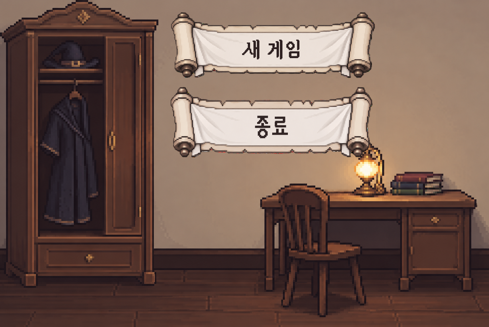
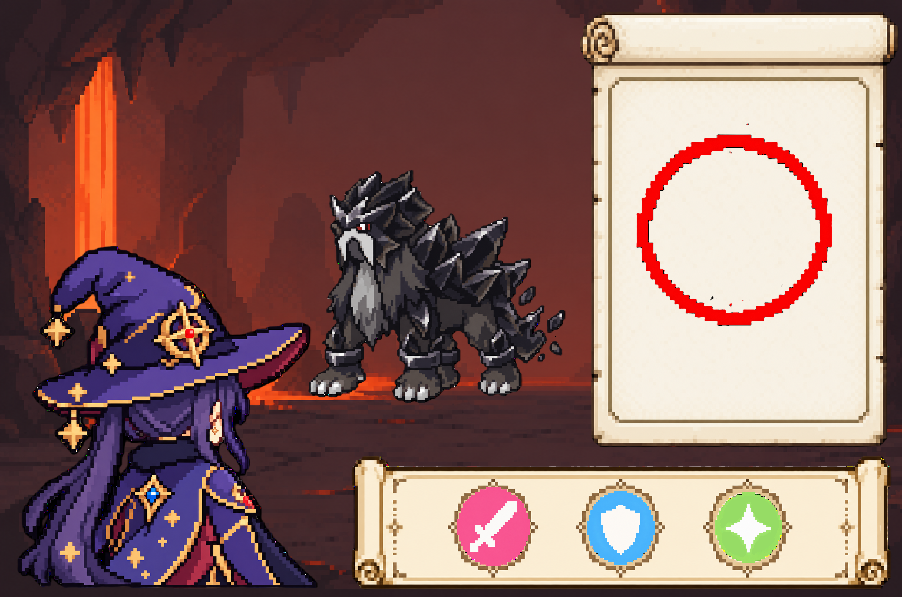
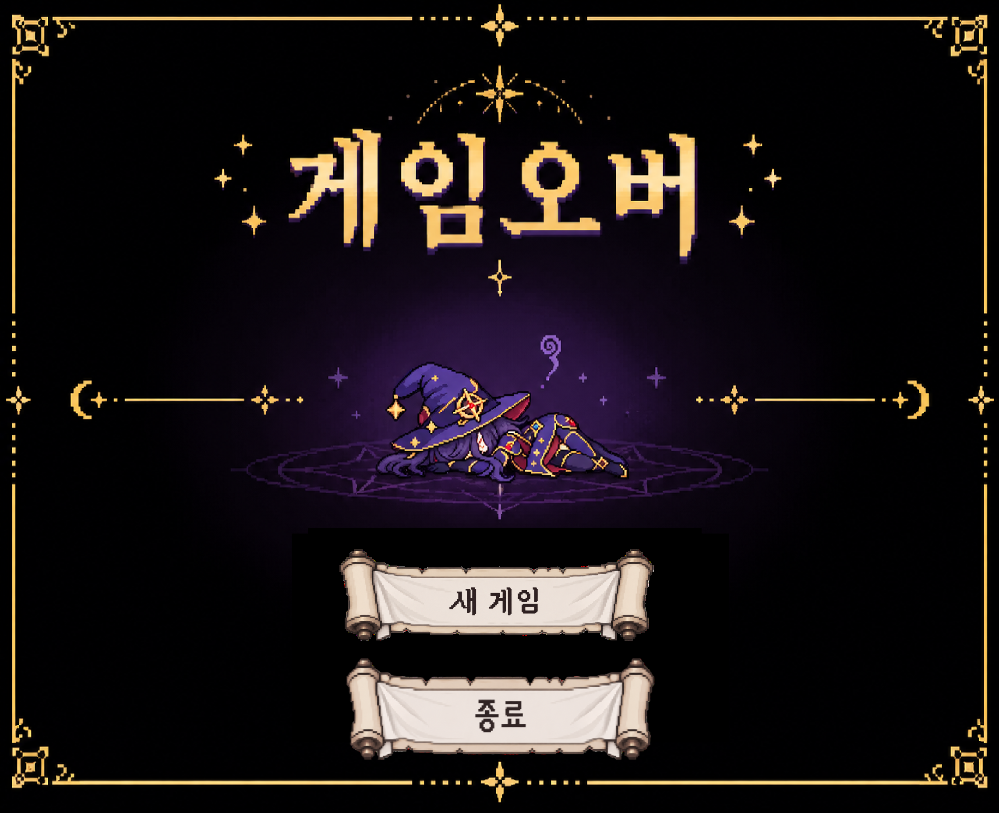

# 아스트랄 아트리에

- 장르: 마법 도형 드로잉 기반 턴제 전투
- 플랫폼: Windows PC
- 조작 방식: 마우스 클릭 / 마우스 드래그
- 핵심 콘텐츠: 던전 전투

---

## 1. 게임 개요

플레이어는 마법학교 **아스트랄 아트리에**의 학생이 되어 던전에 등장하는 적과 전투하고 학점을 획득한다.

전투에서는 플레이어와 적이 번갈아 행동한다.

플레이어의 턴이 시작되면 **공격, 방어, 버프** 중 하나를 선택한다.

행동을 선택하면 제한시간이 시작되고, 화면에 원, 삼각형, 사각형, 별 중 하나의 도형이 무작위로 제시된다.

플레이어는 제한시간 동안 제시되는 도형을 마우스로 최대한 많이 그린다.

도형 입력에 성공하면 즉시 다음 무작위 도형이 표시되며, 제한시간이 끝날 때까지 반복한다.

제한시간 동안 성공한 도형의 수가 많을수록 선택한 행동의 효과가 강해진다.

던전 전투에서 승리하면 사용한 턴 수에 따라 학점을 획득하며, 누적 학점이 목표 학점에 도달하면 게임을 클리어한다.

### 1.1 승패 조건

#### 승리

- 적의 HP가 0 이하가 되면 전투에서 승리한다.
- 전투에서 사용한 턴 수를 기준으로 학점을 획득한다.
- 획득한 학점을 누적 학점에 추가한다.

#### 패배

- 플레이어의 HP가 0 이하가 되면 전투에서 패배한다.
- 전투를 종료하고 종료 Scene으로 이동한다.

---

## 2. 게임 진행 흐름

```text
게임 시작
↓
게임 시작 Scene
↓
새 게임
↓
플레이 Scene
↓
아카데미
↓
던전 선택
↓
적 조우
↓
전투
↓
승리 / 패배
```

전투에서 승리한 경우:

```text
적 처치
↓
사용 턴 수 계산
↓
획득 학점 계산
↓
누적 학점 증가
↓
목표 학점 확인
```

목표 학점에 도달하지 않은 경우:

```text
결과 확인
↓
아카데미
↓
다음 던전 선택
```

목표 학점에 도달한 경우:

```text
게임 클리어
↓
종료 Scene
```

전투에서 패배한 경우:

```text
플레이어 HP 0
↓
게임 오버
↓
종료 Scene
```

---

## 3. Scene 구성

### 3.1 게임 시작 Scene



#### 표시 요소

| 요소 | 기능 |
| --- | --- |
| 새 게임 | 새로운 게임 시작 |
| 종료 | 게임 종료 |

`새 게임`을 선택하면 게임 데이터를 초기화하고 플레이 Scene으로 이동한다.

---

### 3.2 플레이 Scene



#### 표시요소

전투 화면에는 다음 요소를 표시한다.

| 요소 | 위치 |
| --- | --- |
| 적 | 화면 우측 중앙 |
| 플레이어 | 좌측하단 |
| 공격 버튼 | 화면 하단 |
| 방어 버튼 | 화면 하단 |
| 버프 버튼 | 화면 하단 |
| 도형 입력 영역 | 화면 오른쪽 |

---

### 3.3 종료 Scene

게임 오버 또는 게임 클리어 시 표시한다.

#### 게임 오버



플레이어의 HP가 0이 되었을 경우 표시한다.

표시 요소:

- 게임 오버
- 다시 시작
- 메인 화면

#### 게임 클리어

누적 학점이 목표 학점 이상이 되었을 경우 표시한다.

표시 요소:

- 게임 클리어
- 최종 누적 학점
- 메인 화면
- 게임 종료

---

## 4. 기본 전투 진행 흐름

플레이어와 적이 한 번씩 번갈아 행동하는 턴제 전투를 사용한다.

플레이어가 먼저 행동한다.

```text
전투 시작
↓
플레이어 턴
↓
공격 / 방어 / 버프 선택
↓
제한시간 동안 도형 입력
↓
성공한 도형 수 계산
↓
플레이어 행동 적용
↓
적 HP 확인
↓
적이 살아있으면 적 턴
↓
적 행동
↓
플레이어 HP 확인
↓
플레이어가 살아있으면 플레이어 턴
```

적 또는 플레이어의 HP가 0 이하가 될 때까지 반복한다.

---

## 5. 플레이어 턴

플레이어 턴이 시작되면 공격, 방어, 버프 버튼을 활성화한다.

플레이어는 세 행동 중 하나만 선택할 수 있다.

진행 순서는 다음과 같다.

1. 플레이어 턴을 시작한다.
2. 공격, 방어, 버프 버튼을 표시한다.
3. 플레이어가 행동 하나를 선택한다.
4. 행동 선택 버튼을 비활성화한다.
5. 도형 입력 영역을 활성화한다.
6. 제한시간을 시작한다.
7. 무작위 도형 하나를 표시한다.
8. 플레이어가 도형을 입력한다.
9. 성공하면 성공 횟수를 1 증가시킨다.
10. 새로운 무작위 도형을 표시한다.
11. 제한시간이 끝날 때까지 반복한다.
12. 제한시간이 종료되면 성공한 도형 수를 계산한다.
13. 선택한 행동의 효과를 적용한다.
14. 적이 살아있다면 적 턴으로 이동한다.

플레이어가 행동 하나를 완료하면 사용 턴 수를 1 증가시킨다.

---

## 6. 도형 입력 시스템

전투에서 사용하는 도형은 다음 네 종류이다.

| 도형 | 형태 |
| --- | --- |
| 원 | ○ |
| 삼각형 | △ |
| 사각형 | □ |
| 별 | ☆ |

행동을 선택하면 네 종류의 도형 중 하나를 무작위로 선택하여 입력 영역에 표시한다.

모든 도형의 등장 확률은 동일하다.

같은 도형이 연속으로 등장할 수 있다.

예시:

```text
원
↓
별
↓
삼각형
↓
삼각형
↓
사각형
↓
원
```

한 번에 하나의 도형만 표시한다.

현재 도형 입력에 성공하면 해당 도형을 제거하고 즉시 새로운 무작위 도형을 표시한다.

제한시간이 남아 있는 동안 계속해서 새로운 도형을 입력할 수 있다.

---

## 7. 도형 입력 판정

플레이어는 마우스 왼쪽 버튼을 누른 상태에서 드래그하여 현재 제시된 도형을 그린다.

### 입력 시작

- 마우스 왼쪽 버튼을 누르면 도형 입력을 시작한다.
- 입력 중 마우스의 이동 경로를 기록한다.
- 마우스 왼쪽 버튼을 놓으면 입력을 종료하고 성공 여부를 판정한다.

### 성공 판정

플레이어가 그린 선이 현재 제시된 도형의 판정 기준을 만족하면 성공으로 처리한다.

```text
도형 입력 성공
↓
성공 횟수 +1
↓
현재 도형 제거
↓
새로운 무작위 도형 표시
```

### 실패 판정

판정 기준을 만족하지 못하면 실패로 처리한다.

```text
도형 입력 실패
↓
성공 횟수 유지
↓
현재 도형 유지
↓
다시 입력
```

- 실패해도 성공 횟수는 감소하지 않는다.
- 실패해도 플레이어 HP는 감소하지 않는다.
- 실패한 도형은 그대로 유지한다.
- 제한시간은 실패 여부와 관계없이 계속 흐른다.

따라서 실패에 대한 패널티는 **도형을 다시 입력하면서 발생하는 시간 손실**이다.

---

## 8. 제한시간

플레이어가 공격, 방어, 버프 중 하나를 선택하면 도형 입력 제한시간이 시작된다.

| 항목 | 규칙 |
| --- | --- |
| 제한시간 시작 | 행동 선택 직후 |
| 제한시간 종료 | 남은 시간이 0 이하 |
| 시간 계산 | `DeltaTime` 기준 |
| 공격 제한시간 | 동일 |
| 방어 제한시간 | 동일 |
| 버프 제한시간 | 동일 |

제한시간 동안 성공한 도형의 개수를 기록한다.

남은 시간이 0 이하가 되면:

1. 새로운 도형을 생성하지 않는다.
2. 진행 중인 도형 입력을 종료한다.
3. 성공한 도형 수를 확정한다.
4. 선택한 행동의 효과량을 계산한다.

행동을 새로 시작할 때마다 성공 도형 수를 0으로 초기화한다.

---

## 9. 행동 종류

플레이어가 사용할 수 있는 행동은 공격, 방어, 버프 세 종류이다.

각 행동은 제한시간 동안 성공한 도형의 수에 따라 효과량이 증가한다.

### 9.1 공격

적에게 직접 피해를 준다.

```text
최종 공격 피해
=
성공한 도형 수 × 도형 1개당 공격 피해
```

성공한 도형 수가 많을수록 적에게 더 큰 피해를 준다.

플레이어에게 버프 효과가 적용되어 있다면 공격 피해에 버프 수치를 추가 적용한다.

적에게 방어 효과가 적용되어 있다면 적의 방어 수치만큼 최종 피해가 감소한다.

공격 행동 완료 후 적용 중이던 플레이어의 버프 효과는 제거한다.

---

### 9.2 방어

다음 적의 공격으로 받을 피해를 감소시킨다.

```text
플레이어 방어량
=
성공한 도형 수 × 도형 1개당 방어량
```

방어 효과는 다음 적 공격까지 유지된다.

적이 플레이어를 공격할 경우:

```text
최종 피해
=
적 공격력 - 플레이어 방어량
```

최종 피해는 0보다 작아질 수 없다.

적의 공격을 한 번 방어하면 방어 효과를 제거한다.

---

### 9.3 버프

플레이어의 다음 공격 피해를 증가시킨다.

```text
버프량
=
성공한 도형 수 × 도형 1개당 버프 증가량
```

버프 효과는 다음 공격 행동까지 유지된다.

버프 상태에서 방어 행동을 사용해도 버프는 제거되지 않는다.

다음 공격 행동을 사용하면 공격 피해에 버프 효과를 적용한 뒤 버프를 제거한다.

---

## 10. 적 행동

적은 자신의 턴에 공격 또는 방어 행동을 사용한다.

적 종류에 따라 행동 확률이나 행동 순서를 다르게 설정할 수 있다.

### 10.1 공격

적이 자신의 공격력만큼 플레이어에게 피해를 준다.

플레이어에게 방어 효과가 없는 경우:

```text
최종 피해
=
적 공격력
```

플레이어에게 방어 효과가 있는 경우:

```text
최종 피해
=
Max(0, 적 공격력 - 플레이어 방어량)
```

피해를 적용한 뒤 플레이어의 방어 효과를 제거한다.

---

### 10.2 방어

적이 자신에게 방어 효과를 부여한다.

방어 효과는 다음 플레이어의 공격까지 유지된다.

플레이어가 공격할 경우:

```text
최종 피해
=
Max(0, 플레이어 공격 피해 - 적 방어량)
```

플레이어의 공격을 한 번 받은 뒤 적의 방어 효과를 제거한다.

---

## 11. 전투 종료

플레이어 또는 적의 HP가 0 이하가 되면 전투를 종료한다.

### 플레이어 승리

```text
적 HP <= 0
```

1. 적의 행동을 중지한다.
2. 전투 입력을 비활성화한다.
3. 사용한 플레이어 턴 수를 확인한다.
4. 획득 학점을 계산한다.
5. 누적 학점에 획득 학점을 추가한다.
6. 게임 클리어 조건을 확인한다.

### 플레이어 패배

```text
플레이어 HP <= 0
```

1. 플레이어 입력을 비활성화한다.
2. 적의 행동을 중지한다.
3. 전투를 종료한다.
4. 종료 Scene의 게임 오버 화면으로 이동한다.

---

## 12. 학점

플레이어가 던전 전투에서 승리하면 학점을 획득한다.

적을 적은 턴으로 쓰러뜨릴수록 더 많은 학점을 획득한다.

학점은 다음 계산식을 사용한다.

```text
획득 학점
=
던전별 학점 기준값 ÷ 사용 턴 수
```

예시:

| 학점 기준값 | 사용 턴 | 획득 학점 |
| ---: | ---: | ---: |
| 100 | 10 | 10 |
| 100 | 5 | 20 |
| 100 | 4 | 25 |

학점 계산에 사용하는 턴 수는 **플레이어가 행동한 횟수**만 사용한다.

- 공격 1회 = 1턴
- 방어 1회 = 1턴
- 버프 1회 = 1턴

적의 행동 횟수는 학점 계산에 포함하지 않는다.

던전마다 서로 다른 학점 기준값을 사용할 수 있다.

---

## 13. 게임 클리어

플레이어는 던전을 반복해서 공략하여 학점을 획득한다.

누적 학점이 목표 학점 이상이 되면 게임을 클리어한다.

```text
누적 학점 >= 목표 학점
```

전투에서 승리하여 학점을 획득한 직후 게임 클리어 여부를 확인한다.

목표 학점에 도달하지 않았다면:

```text
전투 승리
↓
학점 획득
↓
아카데미 복귀
```

목표 학점에 도달했다면:

```text
전투 승리
↓
학점 획득
↓
목표 학점 달성
↓
게임 클리어
↓
종료 Scene
```

---

## 14. 필요 이미지 목록

### 게임 시작 Scene

- 게임 타이틀 이미지
- 시작 화면 배경
- 새 게임 버튼
- 계속하기 버튼
- 설정 버튼
- 종료 버튼

### 아카데미

- 아카데미 배경
- 플레이어 기본 이미지
- 학점 표시 UI
- 던전으로 버튼
- 설정 버튼
- 종료 버튼

### 던전 선택

- 던전 선택 UI
- 던전 썸네일
- 던전 선택 버튼

### 전투

- 플레이어 전투 이미지
- 적 이미지
- 던전 전투 배경
- 플레이어 HP UI
- 적 HP UI
- 제한시간 UI
- 성공 횟수 UI

### 행동 아이콘

#### 공격

- 분홍색 원형 배경
- 흰색 검 아이콘

#### 방어

- 하늘색 원형 배경
- 흰색 방패 아이콘

#### 버프

- 연두색 원형 배경
- 흰색 사각별 아이콘

### 도형

- 원 가이드
- 삼각형 가이드
- 사각형 가이드
- 별 가이드

### 전투 이펙트

- 공격 이펙트
- 적 피격 이펙트
- 방어 이펙트
- 버프 이펙트
- 도형 입력 성공 이펙트
- 도형 입력 실패 이펙트

### 종료 Scene

- 게임 오버 화면
- 게임 클리어 화면
- 다시 시작 버튼
- 메인 화면 버튼

---

## 15. 필요 사운드 목록

### BGM

- 게임 시작 화면 BGM
- 아카데미 BGM
- 던전 전투 BGM
- 게임 클리어 BGM

### UI

- 버튼 선택음
- 버튼 결정음

### 도형 입력

- 도형 입력음
- 도형 입력 성공음
- 도형 입력 실패음

### 전투

- 공격 발동음
- 적 피격음
- 플레이어 피격음
- 방어 효과음
- 버프 효과음

### 결과

- 전투 승리음
- 게임 오버음
- 학점 획득음
- 게임 클리어음