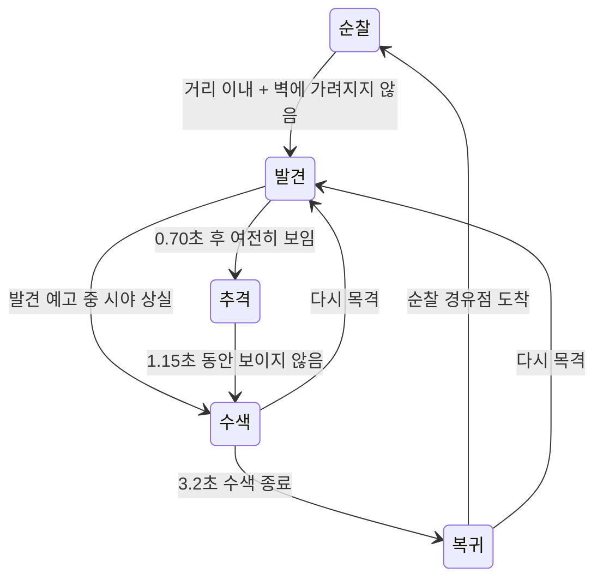

# 설계 설명과 4주차 시연

## 한 문장 기획

네 개의 기억을 모아 상대의 마음을 이해하고, 마지막 인사를 건네는 작은 꿈속 미로 게임.

## 4주차에 확인할 구현

1. 시작 메뉴가 실제 키보드·마우스 입력으로 동작한다.
2. WASD로 움직이며, 몸체가 길 밖으로 나가지 않는다.
3. E로 기억을 읽고 구역 사이의 문을 이용한다.
4. 음악·효과음이 실제 재생되고 음량 조절·음소거가 동작한다.
5. 기억 수에 따라 마지막 만남의 결과가 달라진다.

## 왜 탑다운인가

제공된 일러스트는 복잡한 입체 미로이지만 충돌 정보가 없다. 이를 배경으로만 쓰면 이미지의 다리와 실제 이동 가능한 길이 달라지기 쉽다. 이번 구현은 `Floor[x,y]`라는 하나의 데이터를 바닥 렌더링, 플레이어 이동, 몬스터 이동, 시야와 길찾기가 공유한다. 그래서 길의 테두리와 이동 경계를 설명하고 검증하기 쉽다.

세계는 다섯 개의 독립 화면으로 나뉘지만 포털 그래프는 고리와 중앙 연결을 이룬다. 모든 구역을 하나의 거대한 화면에 넣기보다, 화면 한 장 안에서 길 전체를 읽고 구역 간 연결을 익히게 했다.

## 충돌

월드 좌표 단위는 타일이다. 타일 중심 `(x+0.5,y+0.5)`에서 이동한다. 렌더러만 타일 좌표를 픽셀 좌표로 바꾼다.

플레이어의 반경은 0.21타일, 몬스터는 0.22타일이다. 각 몸체의 네 모서리가 이동 가능 타일에 있는지 확인하고 X, Y 축을 나누어 이동한다. 긴 이동은 0.1타일 이하로 세분화해서 한 프레임에 벽을 통과하지 못하게 한다. 이 작은 정사각형 충돌체와 원형 표시를 통해 판정 범위를 읽게 한다.

대각선 입력은 벡터 길이로 나누므로 직선보다 빨라지지 않는다. 실제 시간 차이 `dt`를 곱하고, 긴 멈춤 이후 과도한 이동이 생기지 않도록 상한을 둔다. 프레임 저하가 상한을 넘으면 게임 시간이 느려지는 정책이다.

## 몬스터 알고리즘

몬스터는 시야가 있을 때만 `LastSeen`을 갱신한다. 수색에서는 현재 플레이어 좌표 대신 `LastSeen`과 그 주변 칸을 사용한다. 경로는 BFS로 찾는다. 한 맵이 25×19칸이고 몬스터가 최대 두 마리여서, 복잡한 자료구조보다 이해하기 쉬운 탐색이 적합하다.

BFS는 도착 칸에서 부모 칸을 따라 되돌아간 뒤 순서를 뒤집는다. 이동 시에는 타일 중심을 경유하므로 모서리를 대각선으로 잘라서 지나가지 않는다. 추격 경로의 재계산은 타일 중심에서 수행해 방향이 바뀔 때 되돌아가는 떨림을 줄인다.

플레이어 속도는 2.85타일/초, 추격은 2.50타일/초, 순찰은 1.15타일/초다. 반응 시간을 주고 추격보다 조금 빨리 움직이게 해, 모퉁이를 이용한 회피가 가능하도록 했다. 어려움은 속도 폭증이 아니라 뒤 구역의 순찰 경로 중첩으로 만든다.

## 입력을 두 집합으로 나눈 이유

`held`는 현재 이동에 사용할 키, `pressed`는 물리적으로 눌린 키를 추적한다. 대화로 넘어갈 때 이동 입력은 비우지만 `pressed`는 KeyUp 전까지 유지한다. 따라서 키보드 자동 반복 신호가 들어와도 E 한 번으로 대화를 여러 페이지 넘기거나 연달아 문을 타지 않는다. 포커스를 잃으면 두 집합을 모두 비운다.

## 진행과 체크포인트

구역 진입 시 기억 배열·빗장 배열을 복제해서 저장한다. 죽었을 때는 복제된 값을 복구한다. 현재 상태와 같은 배열을 참조하면 이후 변경이 체크포인트까지 바꾸므로 반드시 복사한다. 괴물의 위치와 상태는 해당 구역의 초기 순찰 상태로 돌아간다.

기억은 문을 여는 열쇠가 아니다. 문을 통과해도 기억을 놓칠 수 있으며, 마지막 상호작용에서만 네 개를 갖췄는지 판단한다. 그래야 기억 부족 결말이 실제 규칙으로 성립하고, 되돌아가는 탐색도 의미가 있다.

## 사운드 연출

탐색 음악은 조용히 반복된다. 추격에서는 탐색 음악 음량이 낮아지고 저음 두 번의 박동이 반복된다. 발견과 기억 획득은 서로 다른 효과음으로 구분한다. 엔딩 진입 시 기존 곡을 낮춰 닫고 엔딩 곡을 천천히 올린다. 두 배경음이 무제한 중첩되는 구조를 피했다.

음악은 외부 CC0 파일이며, 효과음은 Kenney CC0를 WAV로 변환했다. 추격 박동만 간단한 사인파와 감쇠 포락선으로 새로 만들었다. 게임에는 원본 소리 파일이 모두 포함되고 실행 중 다운로드하지 않는다.

## 3~5분 시연 순서

1. 시작 화면에서 메뉴 이동과 설정의 음량·음소거를 보여준다.
2. 새 게임을 시작하고 도입을 넘긴다.
3. 시작점에서 벽 방향으로 움직여 충돌을 보여준다.
4. 첫 기억을 읽고 J로 다시 읽는다. 대화 중 괴물이 멈추는 것을 설명한다.
5. 금빛 빗장으로 순환 동선이 짧아지고 중앙 문이 열리는 것을 보여준다.
6. 괴물의 발견 신호와 모퉁이 회피를 보여준다. 실패해도 입구 재시작을 시연할 수 있다.
7. Tab 지도에서 네 구역의 고리와 중앙 연결을 설명한다.

시간이 부족하면 정상 엔딩의 상태별 화면은 `Tests/04-ending.png`, `Tests/05-dawn.png`로 소개할 수 있다. **이 이미지들은 테스트에서 해당 상태를 설정해 렌더한 화면이며, 사람이 전 구간을 플레이한 기록이라고 설명하면 안 된다.**

## 첫 구역 길찾기 힌트

시작점에서 아래 길을 오른쪽으로 가다가 첫 세로길을 올라간다. 중간 가로길에서 오른쪽으로 진행하면 기억이 있는 안쪽 통로로 이어진다. 금빛 빗장은 기억보다 아래쪽에 있다. 지름길을 열면 시작점의 아래 길과 연결된다는 점을 확인할 수 있다.

## 다음 개선에서 확인할 것

사람의 전체 플레이를 기록해 실제 길찾기 시간, 발견 후 탈출률, 반복 사망 지점을 확인한다. 필요하면 먼저 순찰 경유점과 발견 거리를 조정하고, 새로운 기능을 더해 문제를 덮지 않는다. 수업 라이브러리 연동이 필요하면 로직과 렌더러 사이의 경계를 활용한다.
